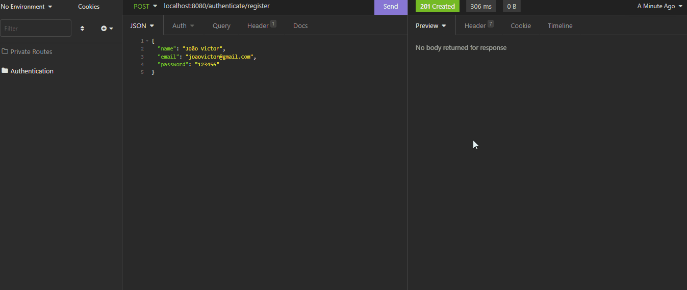

# Login com JWT

API desenvolvida para fins didáticos para autenticação e autorização de rotas usando JWT com criptografia

## 🚀 Tecnologias

- [Spring Boot](https://spring.io/)

- [Spring Security](https://spring.io/projects/spring-security)

- [Spring Data JPA](https://spring.io/projects/spring-data-jpa)

- [JSON Web Token](https://jwt.io/)

- [H2 Database](https://www.google.com/search?q=h2+database&oq=h2+database&aqs=chrome.0.0i512l10.1342j0j7&sourceid=chrome&ie=UTF-8)

---

Feito com 💜 por Dicous DEV 👋 [Veja meu LinkedIn](https://www.linkedin.com/in/jo%C3%A3o-duarte-dev/)
